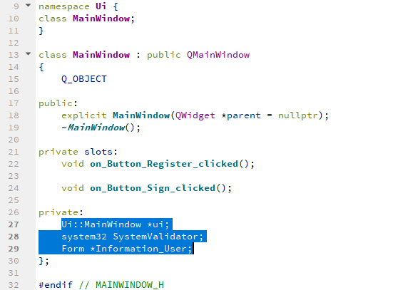

# MATHSOFT
“MATHSOFT” busca incentivar el aprendizaje y mejorar la habilidad para la matemática a través de una interfaz sencilla y divertida. La interfaz va a permitir escoger al usuario un avatar, el cual va a poder ser personalizado con los diferentes “skins” que se irán ganando mientras se avance en el juego y se consigan logros. El juego estará distribuido en niveles, los cuales se irán alcanzando conforme el usuario vaya superando cada objetivo propuesto, la complejidad de las operaciones aumentará a medida que se alcance un nuevo nivel.

### Propósito
El propósito principal del desarrollo de este videojuego es la estimulación y mejora en el aprendizaje de los niños entre 6 y 12 años, los cuales son atraídos a través de un sistema de recompensas al completar los retos.

### Funcionalidades
* Como primera opción al ingresar por primera vez al juego, se va a realizar el registro del usuario para poder crear un perfil con sus datos, y de esta manera guardar el avance que vaya logrando, además cada usuario va a poder elegir un avatar el cual, dependiendo de los logros alcanzados, podrá personalizarse.
* Dependiendo del nivel en el que se encuentre el jugador, se irán proporcionando operaciones matemáticas, y se irá almacenando la cantidad de errores y aciertos que tenga cada jugador.
* Dependiendo de los logros que alcance cada jugador, este será recompensado con “skin” nuevos, y la complejidad de las operaciones será mayor.

### Autores
* [Yordy W. Santos Apaza](https://github.com/syordya)
* [Jhon I. Flores Pacheco](https://github.com/leviroseb)
* [Victor M. Janampa Canahuire](https://github.com/VictorJanampa)

### Características de los usuarios
* La población objetivo son niños en etapa escolar, entre 6 y 12 años, los cuales se están iniciando en el mundo de la matemática.
* Una característica propia de esta edad es su curiosidad, las ganas de aprender cosas nuevas cada día, pero a su vez la diversión como parte importante.

### Definiciones
* Datos: Información de registro del usuario en el sistema.
* GUI: Interfaz gráfica de usuario.
* Máximo: Puntaje máximo alcanzado en el juego.
* Skin: Aspecto de avatar del jugador.
* Avatar: Aspecto del jugador dentro del juego.
* Perfil: Datos personales del jugador.

## Módulos del software
| Nombre | Descripción | Encargados |
| ------------- | ------------- | ------------- |
| Registro de usuario | El sistema permite el registro de usuarios que deseen aprender con MathSoft. | Victor Janampa, Yordy Santos |
| Validación de usuario | El sistema valida el nombre de usuario y contraseña para ingresar al sistema. | Jhon Flores, Yordy Santos |
| Función de recuperar contraseña | El sistema permite generar una nueva contraseña mediante preguntas de validación. | Jhon Flores, Yordy Santos |
| Vista del perfil de usuario | El sistema permite visualizar el perfil y avatar de usuario. | Victor Janampa, Yordy Santos |
| Diseño GUI del avatar | El sistema permite obtener accesorios para personalizar el avatar de usuario. | Jhon Flores, Yordy Santos |
| Módulos de aprendizaje | MathSoft busca incentivar el aprendizaje y mejorar la habilidad para la matemática, en un trabajo futuro para más asignaturas. | Jhon Flores, Yordy Santos |
| Niveles de dificultad | El sistema genera una variación de la dificultad al percibir el progreso del usuario y asimismo entrega las recompensas de acuerdo a su nivel. | Victor Janampa, Yordy Santos |
| Recompensas especiales | El sistema genera una recompensa para personalizar el avatar de usuario por cada logro completado. | Victor Janampa, Yordy Santos |
| Módulo de evaluación | En este módulo se asigna una puntuación por nivel o logro alcanzado, aumenta a medida que se alcance un nuevo reto y obtiene el puntaje máximo de usuario. | Victor Janampa, Jhon Flores, Yordy Santos |
| Módulo de ayuda | En este módulo se brinda una ayuda al usuario en caso de no poder resolver en cierta cantidad de intentos, ofreciendo un pequeño tutorial del tema. | Victor Janampa, Jhon Flores, Yordy Santos |

## Estilos de programación

### Módulo: Registro de usuario

* Letterbox (Incorpora mensajes en el registro de usuario)

* Constructivist (Prácticas contra posibles errores del usuario)

* Spreadsheet (Tabula los datos de registro del usuario)

### Módulos: Validación de usuario, Función de recuperar contraseña
* Bulletin Board (Generaliza las operaciones de datos en ingreso y verificación)

* Aspects (Simplifica y ordena el desarrollo del código para su funcionalidad)

### Módulo: Diseño GUI del avatar
* Plugins (Amplia las funciones de personalización del GUI)

### Módulo: Evaluación
* Letterbox (Incorpora mensajes en la evaluación)

* Constructivist (Prácticas contra posibles errores del usuario)

* Aspects (Simplifica y ordena el desarrollo del código para su funcionalidad)

## S.O.L.I.D.
### Principio de Sustitución de Liskov (LSP)
Módulos: Módulo de evaluación, Recompensas especiales.

Herencia en el proceso de generación de operaciones matemáticas aleatorias.

### Principio de segregación de Interfaces (ISP)
Módulos: Validación de usuario, Registro de usuario.

#### COHESIÓN
Cohesión Funcional: Cuando el módulo ejecuta una y sólo una tarea, teniendo un único objetivo a cumplir, se dice que tiene cohesividad funcional.

#### ACOPLAMIENTO
Acoplamiento de Control: Cuando un módulo le envía a otro un elemento de control que determina la lógica de ejecución del mismo.

### Principio de la Inversión de Dependencias (DIP)
Módulos: Vista del perfil de usuario, Validación de usuario, Recompensas especiales.

Finalidad de reducir el acoplamiento en la clase Recompensa, esto hará que se reduzca la dependencia entre los módulos de código de dicha clase.

## DOMAIN-DRIVEN DESIGN (DDD)
### LENGUAJE UBICUO
Se le puede definir como un lenguaje común entre los desarrolladores y los ususarios.
DDD ayuda a lograr más cercano al lenguaje natural, para obtener como resultado final un producto que debe ser comprensible para todos los miembros del equipo independientemente de su rol.

### CAPAS DE LA ARQUITECTURA
#### USER INTERFACE
Presenta la información al usuario, interpreta sus acciones y las envía a la aplicación.

#### APPLICATION
Encargada de verificar e interactuar con los diferentes usuarios durante el uso de la aplicación.

#### DOMAIN
Es el núcleo de la aplicación que contiene las reglas del "negocio" y el responsable de mantener los objetos del negocio.
En el caso de Mathsoft el núcleo es el manejo de data y las operaciones matemáticas que la aplicación realiza.

#### INFRASTRUCTURE
Capa de soporte para el resto de capas, provee la comunicación con las otras capas e implementa las persistencias de los objetos de negocio y las librerías de soporte para las otras capas.
En el caso de Mathsoft se hizo uso de interconexión en ventanas de SFML y QT permitiendo el uso de diferentes capas.

#### MODULES
* Registro de usuario.
* Interfaz de la aplicación.
* Verificación de datos.
* Realización de operaciones.

## PRACTICAS DE CÓDIGO LEGIBLE
#### Comentar y Documentar

#### Sangrado consistente

#### Evite Comentarios Obvios
Poca precencia de comnetarios ya que el nombre de las variables y metodos lo describen por si solo

#### Agrupación de Código

#### Esquema de Nomenclatura Consistente

#### Evite la Anidación Profunda

#### Limite la Longitud de Línea

#### Organización de Archivos y Carpetas

#### Orientado a Objetos vs. Procedural

## Imagenes del GUI

#### Login

#### Registro

#### Perfil

